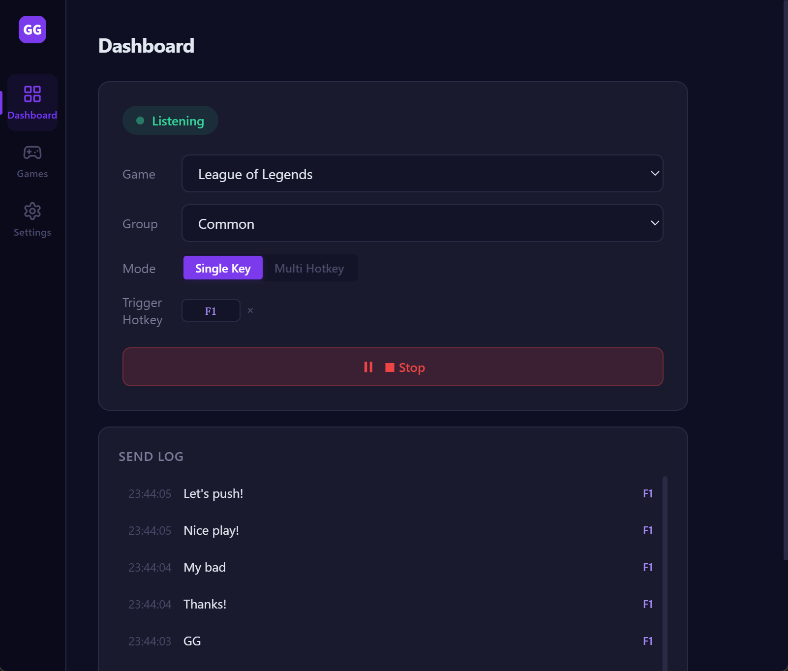
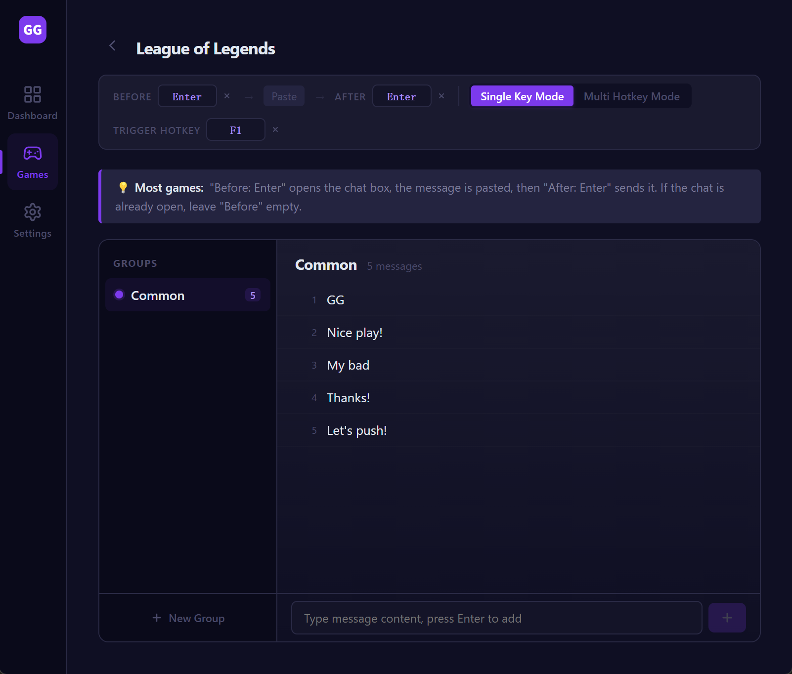
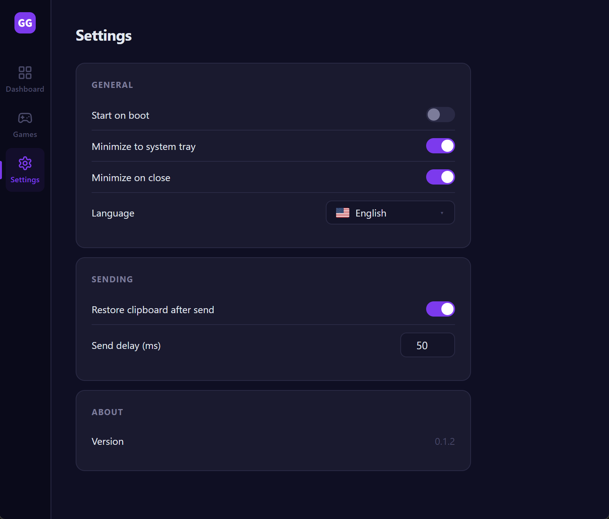

# GGSay

[ 简体中文](./docs/README.zh-CN.md) · [ 繁體中文](./docs/README.zh-TW.md) · ** English** · [ 日本語](./docs/README.ja.md) · [ 한국어](./docs/README.ko.md) · [ Español](./docs/README.es.md) · [ Français](./docs/README.fr.md) · [ Deutsch](./docs/README.de.md)

---

A desktop tool for sending preset messages in-game with a single keystroke. Bind hotkeys, hold to repeat, release to stop.

Built with Tauri + Vue 3 — small installer, fast startup, native performance. Windows supported.

## ✨ Features

- **Global hotkeys** — trigger from any game without switching windows
- **Two trigger modes**
  - Single-key: one hotkey picks a random message from the active group (shuffle, no repeats)
  - Multi-hotkey: each message gets its own hotkey for precise control
- **Hold to repeat** — keep sending while the hotkey is held, stop the moment you release
- **Games / Groups / Messages** — three-level organization, switch scenes in one click
- **Pre / Post actions** — configurable keys around send (e.g. Enter to open/close chat)
- **Auto language detection** — follows your OS language on first launch; 8 languages supported
- **System tray** — minimize to tray on close, never disturbs your game
- **Auto-start on boot** (optional)
- **Local data** — config stored in local SQLite, fully under your control

## 📸 Screenshots







## 🚀 Installation

Download the latest **Windows x64** installer from [Releases](https://github.com/rechard-edward/ggsay/releases):

- `ggsay_x.y.z_x64-setup.exe` — a single multilingual installer. The setup wizard and the app itself support 8 languages (Chinese Simplified / Traditional, English, Japanese, Korean, Spanish, French, German) and auto-detect your OS language on first launch.

### ⚠️ First-time install notice

On first launch, **Windows SmartScreen may show a "Windows protected your PC" warning**. The installer is not signed with a paid code-signing certificate yet, which is normal for early open-source releases. To proceed: click **More info** → **Run anyway**.

Your antivirus may also flag the app. GGSay works by **simulating keystrokes** (Ctrl+V, Enter) to paste and send messages inside games — that's the core feature. Some antivirus products treat any app that synthesizes keyboard input as suspicious by default. The source code is fully open in this repository; you can audit it or build it yourself. If your AV blocks the app, add `ggsay.exe` to its exclusion list.

## 🎮 Usage

1. **Create a game**: Games page → New Game, enter a name
2. **Configure pre / post actions**: most games use Enter to open chat + Enter to send
3. **Create groups and add messages**: organize by scenario (e.g. "Ranked", "Casual")
4. **Set trigger hotkeys**:
   - Single-key mode: one hotkey per game
   - Multi-hotkey mode: one hotkey per message
5. **Dashboard → Start Listening**: back to your game, press the hotkey to send

## 🛠️ Tech Stack

- **Frontend**: Vue 3 + TypeScript + Pinia + Vue Router + vue-i18n
- **Desktop shell**: Tauri 2 (Rust)
- **Bundler**: Vite
- **Local storage**: SQLite (via `tauri-plugin-sql`)
- **Global hotkeys**: `tauri-plugin-global-shortcut`
- **Keystroke simulation**: [enigo](https://github.com/enigo-rs/enigo)

## 🧑‍💻 Development

Prerequisites: Node.js 20+, pnpm, Rust toolchain, Visual Studio C++ Build Tools (Windows)

```bash
# Install dependencies
pnpm install

# Dev mode with hot reload
pnpm tauri dev

# Production build + installers
pnpm tauri build
```

Artifacts:

- Main binary: `src-tauri/target/release/ggsay.exe`
- NSIS installer (multilingual): `src-tauri/target/release/bundle/nsis/ggsay_x.y.z_x64-setup.exe`

## 📁 Project Structure

```
ggsay-app/
├── src/                   # Frontend
│   ├── views/             # Pages
│   ├── components/        # Components
│   ├── stores/            # Pinia stores (games / settings)
│   ├── i18n/              # Translations
│   └── router/
├── src-tauri/             # Tauri / Rust
│   ├── src/lib.rs         # Global hotkeys, key simulation, tray
│   ├── capabilities/      # Permissions
│   └── tauri.conf.json    # App config
└── docs/                  # Translated READMEs
```

## 🤝 Contributing

Issues and PRs welcome. Please run `pnpm tauri build` before submitting to make sure it compiles.

## 📄 License

MIT License — see [LICENSE](./LICENSE)

## 🔗 Links

- Website: [ggsay.com](https://www.ggsay.com)
- Issues: [GitHub Issues](https://github.com/rechard-edward/ggsay/issues)
