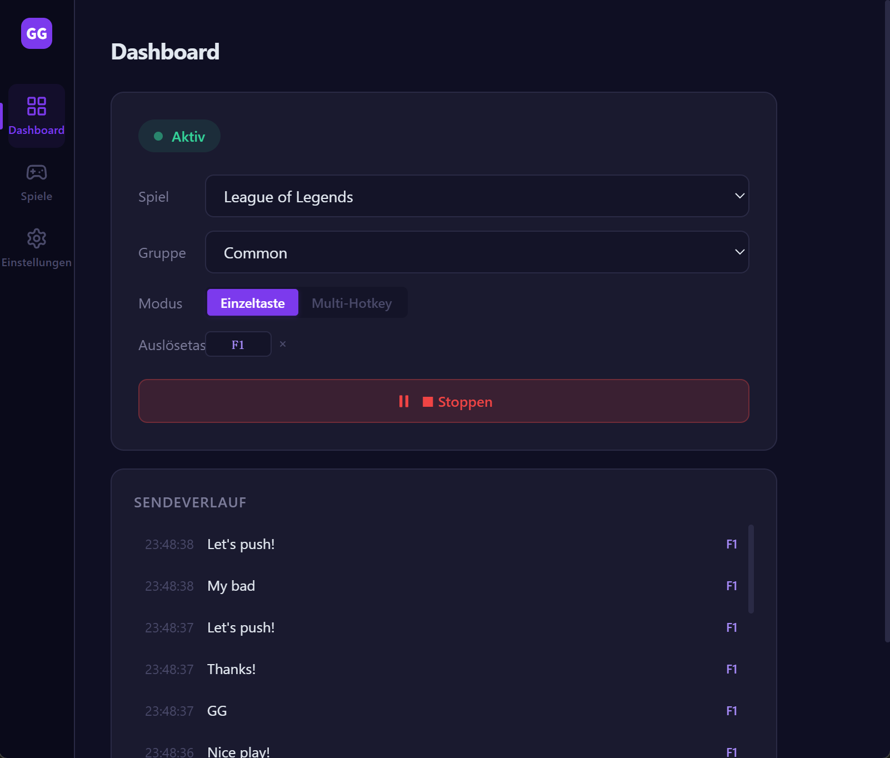
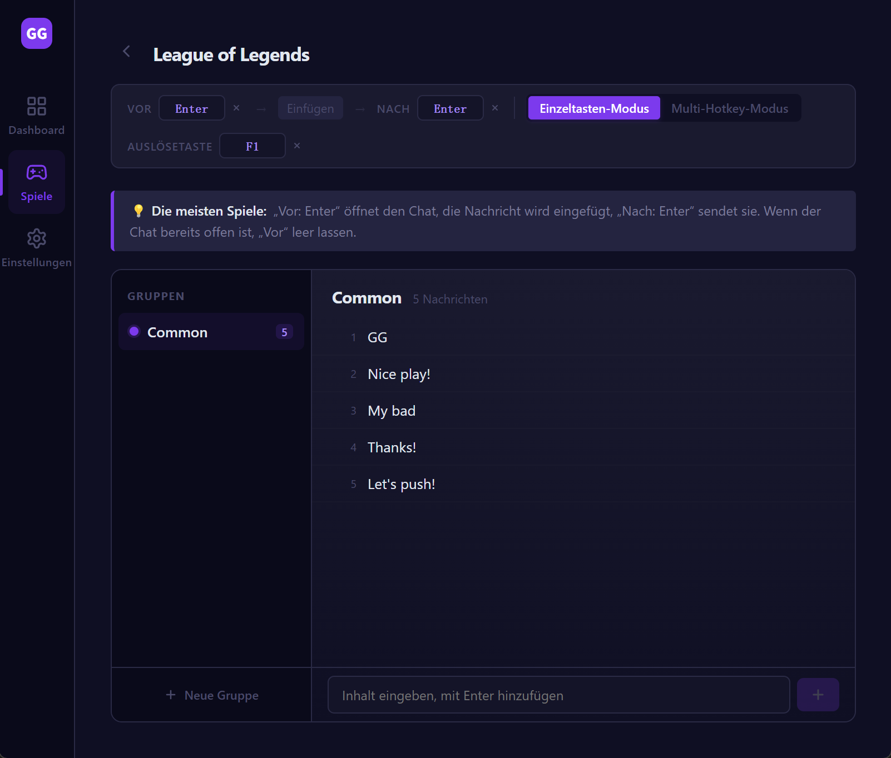
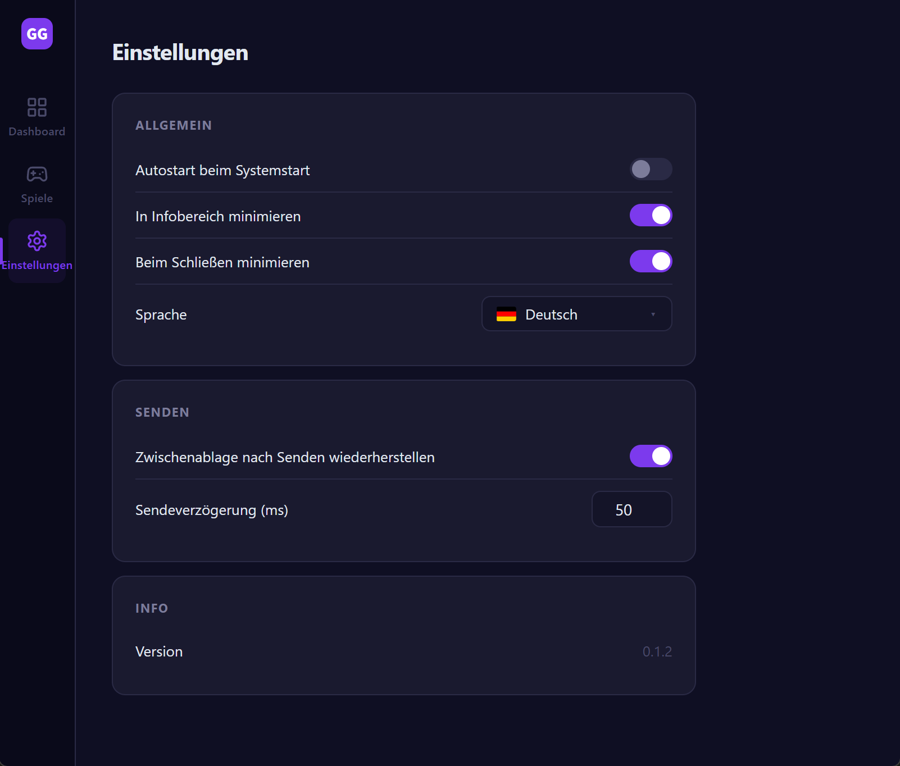

# GGSay

[ 简体中文](./README.zh-CN.md) · [ 繁體中文](./README.zh-TW.md) · [ English](../README.md) · [ 日本語](./README.ja.md) · [ 한국어](./README.ko.md) · [ Español](./README.es.md) · [ Français](./README.fr.md) · ** Deutsch**

---

Ein Desktop-Tool zum Versenden vordefinierter Nachrichten per Tastendruck im Spiel. Hotkeys binden, gedrückt halten für Dauerversand, loslassen zum Stoppen.

Mit Tauri + Vue 3 gebaut — kleiner Installer, schneller Start, native Performance. Windows wird unterstützt.

## ✨ Funktionen

- **Globale Hotkeys** — Auslösen aus jedem Spiel ohne Fensterwechsel
- **Zwei Auslösemodi**
  - Einzeltaste: ein Hotkey wählt zufällig eine Nachricht aus der Gruppe (gemischt, ohne Wiederholung)
  - Multi-Hotkey: jede Nachricht hat einen eigenen Hotkey
- **Gedrückt halten für Wiederholung** — sendet durchgehend, stoppt sofort beim Loslassen
- **Spiele / Gruppen / Nachrichten** — drei-stufige Organisation, Szenenwechsel per Klick
- **Vor- / Nach-Aktionen** — konfigurierbare Tasten um den Sendevorgang (z. B. Enter zum Öffnen/Schließen des Chats)
- **Automatische Spracherkennung** — folgt beim ersten Start der Systemsprache; 8 Sprachen
- **Systembereich** — minimiert beim Schließen in den Tray, stört das Spiel nicht
- **Autostart beim Systemstart** (optional)
- **Lokale Daten** — Konfiguration in lokaler SQLite

## 📸 Screenshots







## 🚀 Installation

Lade den neuesten **Windows x64**-Installer von [Releases](https://github.com/rechard-edward/ggsay/releases):

- `ggsay_x.y.z_x64-setup.exe` — ein einzelner mehrsprachiger Installer. Sowohl der Setup-Assistent als auch die App unterstützen 8 Sprachen (简体中文 / 繁體中文 / English / 日本語 / 한국어 / Español / Français / Deutsch) und erkennen beim ersten Start automatisch die Systemsprache.

### ⚠️ Hinweis zur Erstinstallation

Beim ersten Ausführen des Installers zeigt **Windows SmartScreen möglicherweise die Warnung „Der Computer wurde durch Windows geschützt"**. Der Installer ist noch nicht mit einem kostenpflichtigen Code-Signing-Zertifikat signiert — bei frühen Open-Source-Releases üblich. Es ist kein Virus. Zum Fortfahren: **Weitere Informationen** → **Trotzdem ausführen** klicken.

Dein Antivirus kann die App ebenfalls melden. GGSay **simuliert Tastatureingaben** (Strg+V, Enter), um Nachrichten in Spielen einzufügen und zu senden — das ist die Kernfunktion. Manche Antivirenprogramme stufen per Heuristik jede App als verdächtig ein, die Tasteneingaben synthetisiert. Der Quellcode dieses Repositorys ist vollständig offen; du kannst ihn auditieren oder selbst kompilieren. Wenn dein Antivirus die App blockiert, füge `ggsay.exe` zur Ausschlussliste hinzu.

## 🎮 Verwendung

1. **Spiel anlegen**: Spiele-Seite → Neues Spiel, Name eingeben
2. **Vor- / Nach-Aktionen konfigurieren**: die meisten Spiele nutzen Enter zum Öffnen des Chats + Enter zum Senden
3. **Gruppen anlegen und Nachrichten hinzufügen**: nach Szenario gruppieren (z. B. „Ranked", „Casual")
4. **Auslöse-Hotkeys setzen**:
   - Einzeltasten-Modus: einer pro Spiel
   - Multi-Hotkey-Modus: einer pro Nachricht
5. **Dashboard → Starten**: zurück ins Spiel, Taste drücken zum Senden

## 🛠️ Tech-Stack

- **Frontend**: Vue 3 + TypeScript + Pinia + Vue Router + vue-i18n
- **Desktop-Shell**: Tauri 2 (Rust)
- **Bundler**: Vite
- **Lokaler Speicher**: SQLite (`tauri-plugin-sql`)
- **Globale Hotkeys**: `tauri-plugin-global-shortcut`
- **Tasten-Simulation**: [enigo](https://github.com/enigo-rs/enigo)

## 🧑‍💻 Entwicklung

Voraussetzungen: Node.js 20+, pnpm, Rust-Toolchain, Visual Studio C++ Build Tools (Windows)

```bash
# Abhängigkeiten installieren
pnpm install

# Entwicklungsmodus (Hot-Reload)
pnpm tauri dev

# Produktions-Build + Installer
pnpm tauri build
```

Artefakte:

- Binary: `src-tauri/target/release/ggsay.exe`
- NSIS-Installer (mehrsprachig): `src-tauri/target/release/bundle/nsis/ggsay_x.y.z_x64-setup.exe`

## 📁 Projektstruktur

```
ggsay-app/
├── src/                   # Frontend
│   ├── views/             # Seiten
│   ├── components/        # Komponenten
│   ├── stores/            # Pinia (games / settings)
│   ├── i18n/              # Übersetzungen
│   └── router/
├── src-tauri/             # Tauri / Rust
│   ├── src/lib.rs         # Hotkeys, Tasten-Simulation, Tray
│   ├── capabilities/      # Berechtigungen
│   └── tauri.conf.json
└── docs/                  # Übersetzte READMEs
```

## 🤝 Mitwirken

Issues und PRs willkommen. Führe vor dem Einreichen `pnpm tauri build` aus, um die Kompilierbarkeit zu prüfen.

## 📄 Lizenz

MIT License — siehe [LICENSE](../LICENSE)

## 🔗 Links

- Webseite: [ggsay.com](https://www.ggsay.com)
- Issues: [GitHub Issues](https://github.com/rechard-edward/ggsay/issues)
