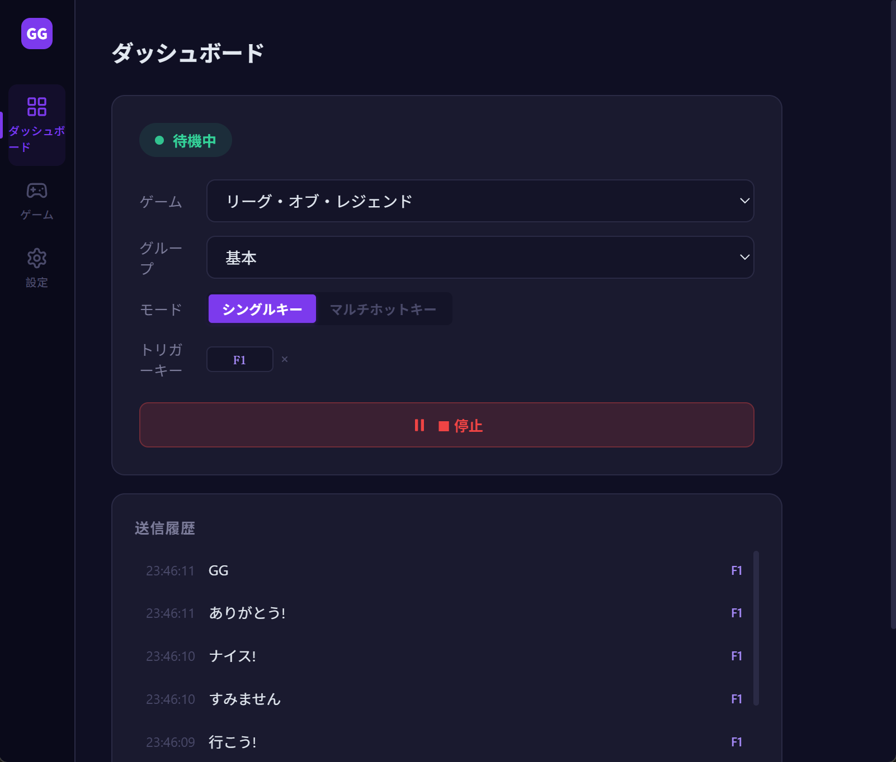
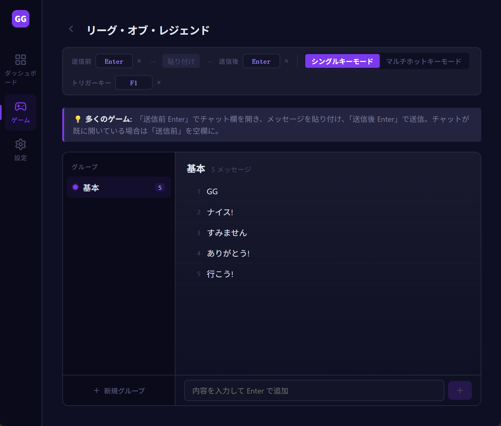
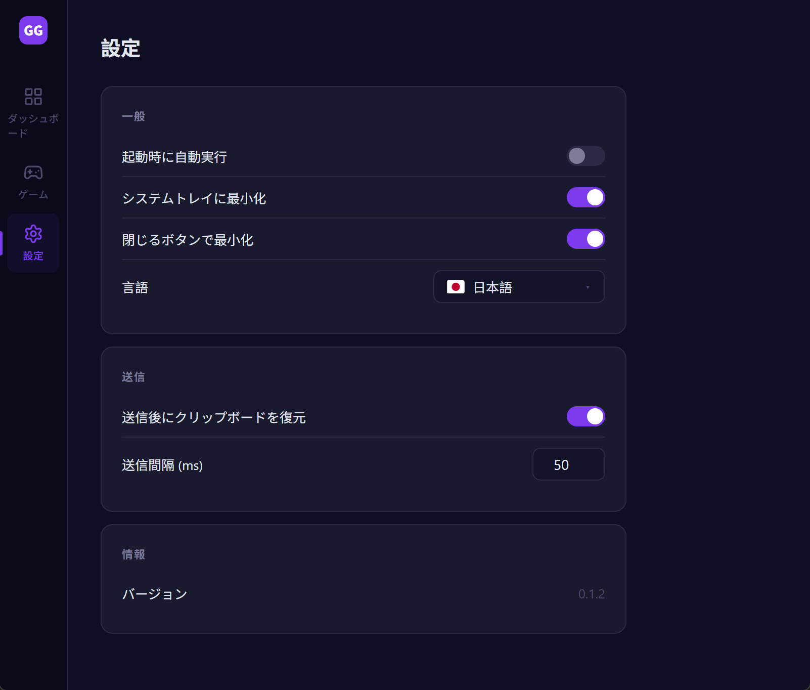

# GGSay

[ 简体中文](./README.zh-CN.md) · [ 繁體中文](./README.zh-TW.md) · [ English](../README.md) · ** 日本語** · [ 한국어](./README.ko.md) · [ Español](./README.es.md) · [ Français](./README.fr.md) · [ Deutsch](./README.de.md)

---

ゲーム内でプリセットメッセージをワンキーで送信するデスクトップツールです。ホットキーをバインドし、長押しで連続送信、離すと即停止。

Tauri + Vue 3 で構築。インストーラー小、起動高速、ネイティブパフォーマンス。Windows 対応。

## ✨ 機能

- **グローバルホットキー** — ゲームからウィンドウを切り替えずに送信
- **2 つのトリガーモード**
  - シングルキー:1 つのホットキーでグループからランダム送信(シャッフル、重複なし)
  - マルチホットキー:メッセージごとに個別のホットキーで正確に指定送信
- **長押しで連続送信** — 押している間送信、離すと即停止
- **ゲーム / グループ / メッセージ**の 3 階層管理、シーン切り替えがワンクリック
- **前 / 後アクション** — 送信前後のキー設定可(例:Enter でチャットを開閉)
- **自動言語検出** — 初回起動時に OS 言語に従う、8 言語対応
- **システムトレイ** — 閉じるとトレイに最小化、ゲームを邪魔しない
- **起動時自動実行**(任意)
- **ローカルデータ** — 設定はローカル SQLite に保存

## 📸 スクリーンショット







## 🚀 インストール

[Releases](https://github.com/rechard-edward/ggsay/releases) から最新の **Windows x64** インストーラーをダウンロード:

- `ggsay_x.y.z_x64-setup.exe` — 単一の多言語インストーラー。セットアップウィザードとアプリ本体の両方が 8 言語(简体中文 / 繁體中文 / English / 日本語 / 한국어 / Español / Français / Deutsch)に対応し、初回起動時に OS の言語を自動検出します。

### ⚠️ 初回インストール時の注意

初回実行時、**Windows SmartScreen が「WindowsによってPCが保護されました」という警告を表示する場合があります**。これはインストーラーがまだ有料のコード署名証明書を使用していないためで、オープンソースの初期リリースでは一般的です。ウイルスではありません。続行するには:**詳細情報** → **実行** をクリック。

ウイルス対策ソフトが誤検知する場合もあります。GGSay はゲーム内でメッセージを送信するため、**キーボード入力をシミュレート**(Ctrl+V、Enter)する必要があります — これがコア機能です。一部のウイルス対策ソフトのヒューリスティックスキャンは、キー入力を合成するアプリをデフォルトで疑わしいとみなします。本リポジトリのソースコードは完全に公開されており、監査や自分でのビルドが可能です。ブロックされた場合は `ggsay.exe` を除外リストに追加してください。

## 🎮 使い方

1. **ゲーム作成**:ゲームページ → 新規ゲーム、名前を入力
2. **前 / 後アクション設定**:多くのゲームは Enter でチャット開 + Enter で送信
3. **グループとメッセージ作成**:シーンごとに分類(例:「ランク」「カジュアル」)
4. **トリガーキー設定**:
   - シングルキーモード:ゲームごとに 1 つ
   - マルチホットキーモード:メッセージごとに設定
5. **ダッシュボード → 開始**:ゲームに戻り、キーを押して送信

## 🛠️ 技術スタック

- **フロントエンド**:Vue 3 + TypeScript + Pinia + Vue Router + vue-i18n
- **デスクトップシェル**:Tauri 2 (Rust)
- **バンドラー**:Vite
- **ローカルストレージ**:SQLite(`tauri-plugin-sql` 経由)
- **グローバルホットキー**:`tauri-plugin-global-shortcut`
- **キー入力シミュレート**:[enigo](https://github.com/enigo-rs/enigo)

## 🧑‍💻 開発

前提:Node.js 20+、pnpm、Rust toolchain、Visual Studio C++ Build Tools(Windows)

```bash
# 依存関係インストール
pnpm install

# 開発モード(ホットリロード)
pnpm tauri dev

# 本番ビルド + インストーラー
pnpm tauri build
```

成果物:

- 本体:`src-tauri/target/release/ggsay.exe`
- NSIS インストーラー(多言語):`src-tauri/target/release/bundle/nsis/ggsay_x.y.z_x64-setup.exe`

## 📁 プロジェクト構造

```
ggsay-app/
├── src/                   # フロントエンド
│   ├── views/             # ページ
│   ├── components/        # コンポーネント
│   ├── stores/            # Pinia (games / settings)
│   ├── i18n/              # 翻訳
│   └── router/
├── src-tauri/             # Tauri / Rust
│   ├── src/lib.rs         # ホットキー、キーシミュレート、トレイ
│   ├── capabilities/      # 権限
│   └── tauri.conf.json
└── docs/                  # 他言語 README
```

## 🤝 貢献

Issue・PR 歓迎。提出前に `pnpm tauri build` でビルド確認をお願いします。

## 📄 ライセンス

MIT License — [LICENSE](../LICENSE) 参照

## 🔗 リンク

- 公式サイト:[ggsay.com](https://www.ggsay.com)
- Issues:[GitHub Issues](https://github.com/rechard-edward/ggsay/issues)
