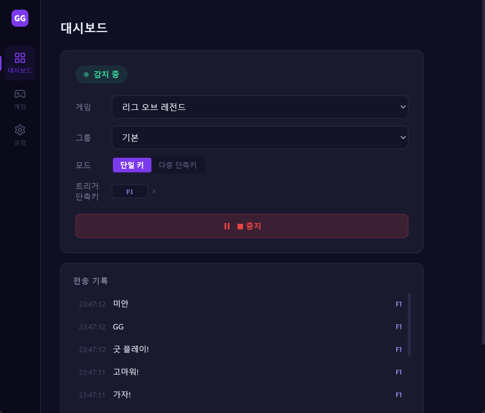
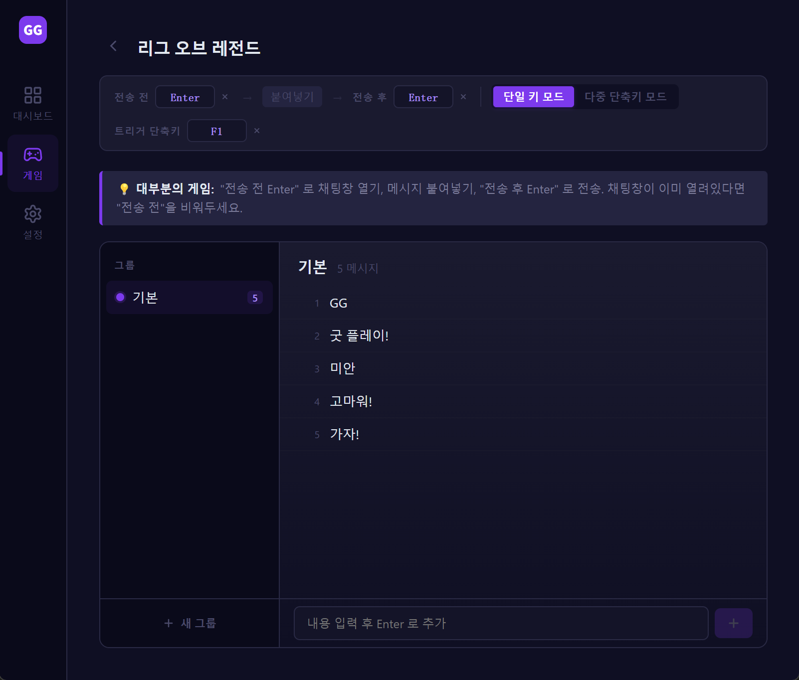
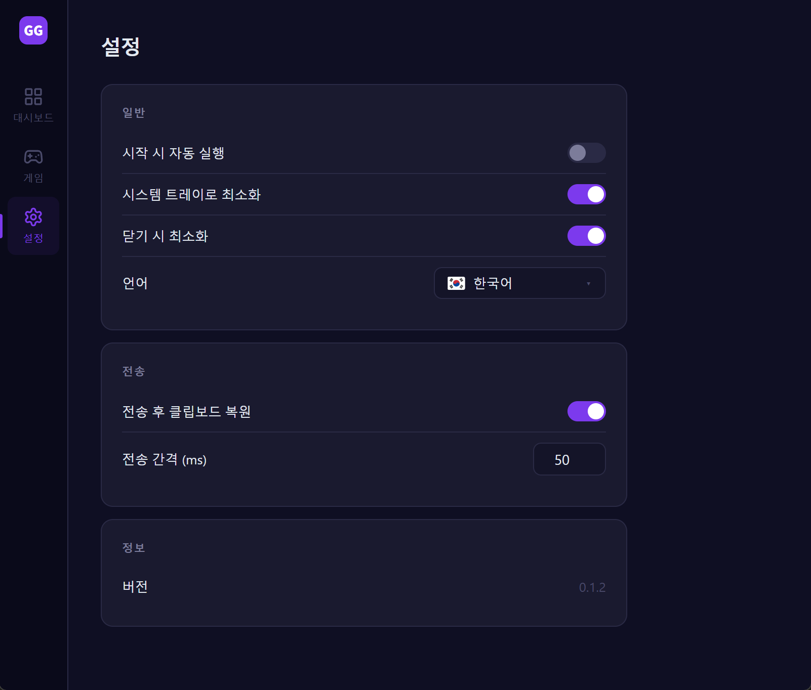

# GGSay

[ 简体中文](./README.zh-CN.md) · [ 繁體中文](./README.zh-TW.md) · [ English](../README.md) · [ 日本語](./README.ja.md) · ** 한국어** · [ Español](./README.es.md) · [ Français](./README.fr.md) · [ Deutsch](./README.de.md)

---

게임 내에서 미리 설정한 메시지를 단축키 하나로 전송하는 데스크톱 도구. 핫키를 바인딩하고, 누르고 있는 동안 연속 전송, 떼면 즉시 중단.

Tauri + Vue 3 기반. 작은 설치 파일, 빠른 시작, 네이티브 성능. Windows 지원.

## ✨ 기능

- **전역 단축키** — 창 전환 없이 어떤 게임에서든 즉시 전송
- **2가지 트리거 모드**
  - 단일 키: 한 단축키로 그룹에서 랜덤 전송 (셔플, 중복 없음)
  - 다중 단축키: 메시지마다 개별 단축키로 정확히 지정 전송
- **누르고 있는 동안 연속 전송** — 떼면 즉시 중단
- **게임 / 그룹 / 메시지** 3단계 관리, 상황 전환 원클릭
- **전 / 후 동작** — 전송 전후 키 설정 가능 (예: Enter로 채팅 열기/닫기)
- **자동 언어 감지** — 첫 실행 시 OS 언어 자동 적용, 8개 언어 지원
- **시스템 트레이** — 닫으면 트레이로 최소화, 게임 방해 없음
- **시작 시 자동 실행** (선택)
- **로컬 데이터** — 설정은 로컬 SQLite에 저장

## 📸 스크린샷







## 🚀 설치

[Releases](https://github.com/rechard-edward/ggsay/releases)에서 최신 **Windows x64** 설치 파일 다운로드:

- `ggsay_x.y.z_x64-setup.exe` — 단일 다국어 설치 프로그램. 설치 마법사와 앱 본체 모두 8개 언어(简体中文 / 繁體中文 / English / 日本語 / 한국어 / Español / Français / Deutsch)를 지원하며, 최초 실행 시 OS 언어를 자동 감지합니다.

### ⚠️ 최초 설치 안내

처음 실행할 때 **Windows SmartScreen이 "Windows에서 PC를 보호했습니다" 경고를 표시할 수 있습니다**. 설치 프로그램이 아직 유료 코드 서명 인증서로 서명되지 않았기 때문이며, 오픈소스 초기 배포에서는 일반적입니다. 바이러스가 아닙니다. 계속하려면: **추가 정보** → **실행** 클릭.

백신이 오탐할 수도 있습니다. GGSay는 게임에서 메시지를 보내기 위해 **키 입력을 시뮬레이션**(Ctrl+V, Enter)해야 하며, 이것이 핵심 기능입니다. 일부 백신의 휴리스틱 스캔은 키 입력을 합성하는 앱을 기본적으로 의심스럽게 처리합니다. 이 저장소의 소스 코드는 완전히 공개되어 있으므로 직접 감사하거나 빌드할 수 있습니다. 백신이 차단하면 `ggsay.exe`를 예외 목록에 추가하세요.

## 🎮 사용법

1. **게임 생성**: 게임 페이지 → 새 게임, 이름 입력
2. **전 / 후 동작 설정**: 대부분 Enter로 채팅 열기 + Enter로 전송
3. **그룹 생성 및 메시지 추가**: 상황별로 분류 (예: "랭크", "일반")
4. **트리거 단축키 설정**:
   - 단일 키 모드: 게임당 하나
   - 다중 단축키 모드: 메시지마다 설정
5. **대시보드 → 시작**: 게임으로 돌아가 단축키 누르면 전송

## 🛠️ 기술 스택

- **프론트엔드**: Vue 3 + TypeScript + Pinia + Vue Router + vue-i18n
- **데스크톱 셸**: Tauri 2 (Rust)
- **번들러**: Vite
- **로컬 저장소**: SQLite (`tauri-plugin-sql`)
- **전역 단축키**: `tauri-plugin-global-shortcut`
- **키 시뮬레이션**: [enigo](https://github.com/enigo-rs/enigo)

## 🧑‍💻 개발

필수: Node.js 20+, pnpm, Rust toolchain, Visual Studio C++ Build Tools (Windows)

```bash
# 의존성 설치
pnpm install

# 개발 모드 (핫 리로드)
pnpm tauri dev

# 프로덕션 빌드 + 설치 프로그램
pnpm tauri build
```

산출물:

- 실행 파일: `src-tauri/target/release/ggsay.exe`
- NSIS 설치 파일 (다국어): `src-tauri/target/release/bundle/nsis/ggsay_x.y.z_x64-setup.exe`

## 📁 프로젝트 구조

```
ggsay-app/
├── src/                   # 프론트엔드
│   ├── views/             # 페이지
│   ├── components/        # 컴포넌트
│   ├── stores/            # Pinia (games / settings)
│   ├── i18n/              # 번역
│   └── router/
├── src-tauri/             # Tauri / Rust
│   ├── src/lib.rs         # 단축키, 키 시뮬레이션, 트레이
│   ├── capabilities/      # 권한
│   └── tauri.conf.json
└── docs/                  # 다국어 README
```

## 🤝 기여

Issue와 PR 환영. 제출 전 `pnpm tauri build`로 빌드 확인 부탁드립니다.

## 📄 라이선스

MIT License — [LICENSE](../LICENSE) 참조

## 🔗 링크

- 웹사이트: [ggsay.com](https://www.ggsay.com)
- Issues: [GitHub Issues](https://github.com/rechard-edward/ggsay/issues)
